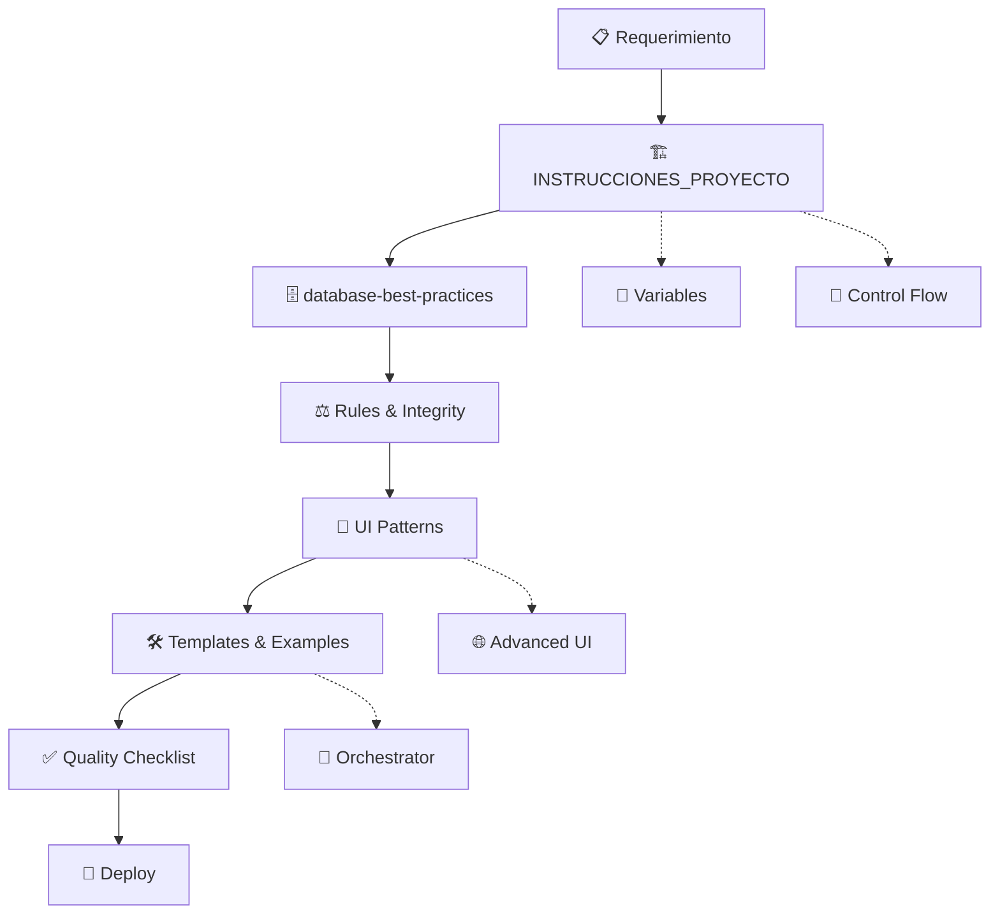
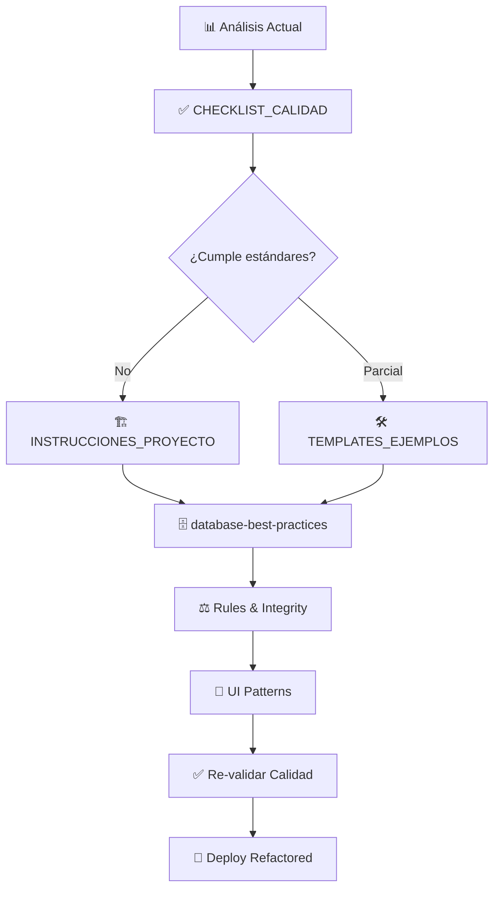
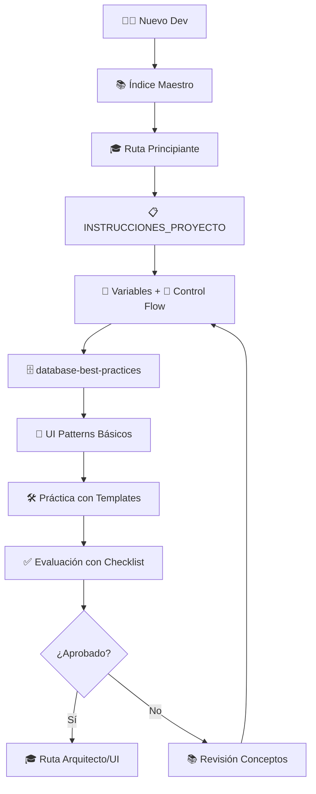

# 📚 Índice Maestro - Documentación GeneXus

---

**Descripción**: Índice completo y navegación entre todos los documentos de GeneXus  
**Versión**: 1.0  
**Fecha**: Noviembre 2025  
**Propósito**: Relacionar y conectar todos los temas de la documentación  

---

## 🎯 Mapa de Navegación

Este documento conecta toda la documentación GeneXus organizada por categorías temáticas y niveles de complejidad.

---

## 📊 Arquitectura del Conocimiento

```text
📚 DOCUMENTACIÓN GENEXUS
├── 🏗️ ARQUITECTURA Y DISEÑO
│   ├── 📋 INSTRUCCIONES_PROYECTO_GENEXUS.md ⭐
│   ├── 🗄️ database-best-practices.md ⭐
│   ├── 🛠️ TEMPLATES_EJEMPLOS_GENEXUS.md ⭐
│   └── ✅ CHECKLIST_CALIDAD_GENEXUS.md ⭐
│
├── 💻 DESARROLLO Y CÓDIGO
│   ├── 📝 Variables.md
│   ├── 🔧 Subrutinas.md
│   ├── 🔄 Comandos de Control de Flujo en GeneXus 18.md
│   ├── ↩️ Comando Return en GeneXus 18.md
│   └── 🔁 Guía Completa Oficial del Comando For Each en GeneXus 18.md
│
├── 🖥️ INTERFAZ DE USUARIO
│   ├── 🎨 Patrón Profesional para WebPanels de Ingreso de Datos - GeneXus 18.md
│   └── 🌐 patrones_webpanel_especializados.md
│
├── 📊 NEGOCIO Y REGLAS
│   ├── ⚖️ Guía Profesional de Rules, Integridad Transaccional.md
│   └── 📋 TransactionalIntegrity.pdf
│
└── 🛠️ UTILIDADES Y HERRAMIENTAS
    └── 🎯 Ejemplo_UTL_Orquestador_GX18.md
```

---

## 🎓 Rutas de Aprendizaje

### 🚀 Ruta: "Desarrollador Principiante"

**Objetivo**: Dominar los fundamentos básicos de GeneXus

1. **📋 Fundamentos del Proyecto** → `INSTRUCCIONES_PROYECTO_GENEXUS.md`
   - Arquitectura y patrones básicos
   - Nomenclatura y convenciones
   - Estructura de proyecto estándar

2. **📝 Conceptos Básicos** → `Variables.md`
   - Diferencia entre variables y atributos  
   - Sintaxis y uso correcto de variables
   - Scope y ciclo de vida

3. **🔄 Control de Flujo** → `Comandos de Control de Flujo en GeneXus 18.md`
   - If, Do Case, For Each
   - Estructuras condicionales
   - Loops y iteraciones

4. **🗄️ Diseño de Datos** → `database-best-practices.md`
   - Nomenclatura GIK
   - Normalización de datos
   - Integridad referencial

### 🏗️ Ruta: "Arquitecto de Soluciones"

**Objetivo**: Diseñar aplicaciones escalables y mantenibles

1. **🏛️ Arquitectura Empresarial** → `INSTRUCCIONES_PROYECTO_GENEXUS.md`
   - Patrones de arquitectura avanzados
   - Separación de responsabilidades
   - Diseño modular

2. **🗄️ Modelado Avanzado** → `database-best-practices.md`
   - Optimización de consultas
   - Índices y performance
   - Estrategias de particionamiento

3. **⚖️ Integridad Transaccional** → `Guía Profesional de Rules, Integridad Transaccional.md`
   - Rules avanzadas de negocio
   - Transacciones complejas
   - Manejo de concurrencia

4. **🛠️ Templates y Reutilización** → `TEMPLATES_EJEMPLOS_GENEXUS.md`
   - Patrones reutilizables
   - Frameworks internos
   - Automatización de desarrollo

### 🎨 Ruta: "Especialista en UI/UX"

**Objetivo**: Crear interfaces de usuario profesionales

1. **🎨 Patrones de UI** → `Patrón Profesional para WebPanels de Ingreso de Datos - GeneXus 18.md`
   - WebPanels minimalistas
   - Separación UI/Business Logic
   - Validaciones centralizadas

2. **🌐 WebPanels Especializados** → `patrones_webpanel_especializados.md`
   - Patrones avanzados de UI
   - Componentes reutilizables
   - Responsive design

3. **✅ Quality Assurance** → `CHECKLIST_CALIDAD_GENEXUS.md`
   - Testing de UI
   - Accesibilidad
   - Performance front-end

---

## 🔗 Matriz de Interrelaciones

### 📊 Tabla de Dependencias

| Documento Principal | Se Relaciona Con | Tipo de Relación | Descripción |
|---------------------|------------------|------------------|-------------|
| `INSTRUCCIONES_PROYECTO_GENEXUS.md` | `database-best-practices.md` | 🔄 Complementaria | Arquitectura ↔ Diseño de Datos |
| `INSTRUCCIONES_PROYECTO_GENEXUS.md` | `Variables.md` | 📚 Referencia | Usa conceptos de variables |
| `INSTRUCCIONES_PROYECTO_GENEXUS.md` | `Comandos de Control de Flujo...md` | 📚 Referencia | Implementa patrones de control |
| `database-best-practices.md` | `Guía Profesional de Rules...md` | 🔄 Complementaria | Datos ↔ Reglas de Negocio |
| `Patrón Profesional para WebPanels...md` | `TEMPLATES_EJEMPLOS_GENEXUS.md` | 🛠️ Implementación | Teoría → Práctica |
| `patrones_webpanel_especializados.md` | `Patrón Profesional para WebPanels...md` | 📈 Extensión | Básico → Avanzado |
| `CHECKLIST_CALIDAD_GENEXUS.md` | **Todos los documentos** | ✅ Validación | QA para todos los patrones |

### 🎯 Casos de Uso Cruzados

#### 🏢 Caso: "Desarrollar Módulo de Clientes Completo"

**Documentos involucrados:**
1. `INSTRUCCIONES_PROYECTO_GENEXUS.md` → Arquitectura general del módulo
2. `database-best-practices.md` → Diseño de tablas Cliente, ClienteDirección, etc.
3. `Variables.md` → Manejo de variables en procedimientos
4. `Patrón Profesional para WebPanels...md` → Pantallas de ingreso/edición
5. `Comandos de Control de Flujo...md` → Lógica de validación y procesamiento
6. `Guía Profesional de Rules...md` → Reglas de integridad del cliente
7. `TEMPLATES_EJEMPLOS_GENEXUS.md` → Templates de CRUD para Cliente
8. `CHECKLIST_CALIDAD_GENEXUS.md` → Verificación de calidad

#### 🛒 Caso: "Sistema de E-commerce"

**Documentos involucrados:**
1. `database-best-practices.md` → Modelo de datos (Producto, Pedido, PedidoLinea)
2. `INSTRUCCIONES_PROYECTO_GENEXUS.md` → Arquitectura modular del e-commerce  
3. `patrones_webpanel_especializados.md` → Catálogo, carrito, checkout
4. `Ejemplo_UTL_Orquestador_GX18.md` → Orquestación de procesos de pedido
5. `Guía Profesional de Rules...md` → Rules de stock, precios, descuentos
6. `TEMPLATES_EJEMPLOS_GENEXUS.md` → Templates de reportes y dashboards

---

## 📚 Referencias Cruzadas por Tema

### 🗄️ **BASE DE DATOS Y MODELADO**

#### Documentos Principales:
- 📊 `database-best-practices.md` - **[MAESTRO]** Guía completa de diseño de BD
- ⚖️ `Guía Profesional de Rules, Integridad Transaccional.md` - Integridad y reglas

#### Conceptos Relacionados:
- **Nomenclatura GIK** → Aplicada en todos los templates
- **Normalización** → Reflejada en estructura de proyectos
- **Índices y Performance** → Considerada en patrones de consulta
- **Integridad Referencial** → Implementada via Rules

#### Referencias en Otros Documentos:
```text
INSTRUCCIONES_PROYECTO_GENEXUS.md
├── Línea 85-90: Convenciones de nomenclatura (usa GIK)
├── Línea 125-140: Estructura de transacciones (aplica normalización)
└── Línea 380-395: Performance en For Each (usa índices)

TEMPLATES_EJEMPLOS_GENEXUS.md  
├── Línea 45-65: Template validación (aplica integridad)
├── Línea 180-220: Procedimiento CRUD (usa nomenclatura GIK)
└── Línea 340-370: Consultas optimizadas (usa índices)
```

### 🎨 **DESARROLLO DE INTERFACES**

#### Documentos Principales:
- 🎨 `Patrón Profesional para WebPanels de Ingreso de Datos - GeneXus 18.md` - **[MAESTRO]**
- 🌐 `patrones_webpanel_especializados.md` - Patrones avanzados de UI

#### Conceptos Relacionados:
- **Separación de Responsabilidades** → UI vs Business Logic
- **Validaciones Centralizadas** → Procedimientos de validación
- **Responsive Design** → Adaptación multi-dispositivo
- **User Experience** → Flujos de usuario optimizados

#### Referencias en Otros Documentos:
```text
INSTRUCCIONES_PROYECTO_GENEXUS.md
├── Línea 150-180: Patrón WebPanel minimalista
├── Línea 210-240: Separación UI/Business Logic
└── Línea 420-450: Responsive patterns

Variables.md
├── Línea 25-35: Variables en eventos de WebPanel
└── Línea 40-50: Scope de variables en UI

TEMPLATES_EJEMPLOS_GENEXUS.md
├── Línea 280-350: Template WebPanel maestro-detalle
└── Línea 680-720: Patrones responsive
```

### 🔧 **LÓGICA DE PROGRAMACIÓN**

#### Documentos Principales:
- 📝 `Variables.md` - Manejo de variables y datos
- 🔄 `Comandos de Control de Flujo en GeneXus 18.md` - **[MAESTRO]** Control flow
- 🔁 `Guía Completa Oficial del Comando For Each en GeneXus 18.md` - Iteraciones
- ↩️ `Comando Return en GeneXus 18.md` - Control de flujo avanzado
- 🔧 `Subrutinas.md` - Modularización de código

#### Conceptos Relacionados:
- **Control de Flujo** → If, Do Case, For Each, Return
- **Variables vs Atributos** → Diferencias fundamentales  
- **Subrutinas** → Modularización y reutilización
- **Optimización** → Performance en loops y consultas

#### Referencias en Otros Documentos:
```text
INSTRUCCIONES_PROYECTO_GENEXUS.md
├── Línea 240-280: Estándares de variables
├── Línea 320-360: Patrones de control de flujo
└── Línea 450-480: Subrutinas y modularización

TEMPLATES_EJEMPLOS_GENEXUS.md
├── Línea 90-140: Template procedimiento validación
├── Línea 160-240: Uso de For Each optimizado
└── Línea 420-460: Patrones de control complejo
```

### ⚖️ **REGLAS DE NEGOCIO E INTEGRIDAD**

#### Documentos Principales:
- ⚖️ `Guía Profesional de Rules, Integridad Transaccional.md` - **[MAESTRO]**
- 📋 `TransactionalIntegrity.pdf` - Documentación técnica oficial

#### Conceptos Relacionados:
- **Rules de Transacción** → [BC] vs [WEB]
- **Integridad Referencial** → Constraints y validaciones
- **Transacciones ACID** → Consistencia de datos
- **Business Logic** → Separación de responsabilidades

#### Referencias en Otros Documentos:
```text
INSTRUCCIONES_PROYECTO_GENEXUS.md
├── Línea 200-230: Rules en transacciones
├── Línea 280-310: Validaciones de negocio
└── Línea 360-380: Integridad en procedimientos

database-best-practices.md
├── Línea 180-220: Integridad referencial
├── Línea 350-380: Rules y constraints
└── Línea 450-490: Validaciones de dominio
```

### 🛠️ **HERRAMIENTAS Y UTILIDADES**

#### Documentos Principales:
- 🎯 `Ejemplo_UTL_Orquestador_GX18.md` - Orquestación de procesos
- 🛠️ `TEMPLATES_EJEMPLOS_GENEXUS.md` - **[MAESTRO]** Templates reutilizables
- ✅ `CHECKLIST_CALIDAD_GENEXUS.md` - Quality Assurance

#### Conceptos Relacionados:
- **Orquestación** → Coordinación de procesos complejos
- **Templates** → Reutilización y estandarización
- **Quality Assurance** → Testing y validación
- **Automatización** → Generación de código

---

## 🎯 Flujos de Trabajo Sugeridos

### 📋 Flujo: "Desarrollo de Nueva Funcionalidad"



### 🔧 Flujo: "Refactoring de Código Existente"



### 📚 Flujo: "Onboarding Nuevo Desarrollador"



---

## 🎓 Niveles de Dominio

### 🥉 **Nivel Bronce - Fundamentos**
**Documentos requeridos:**
- ✅ `INSTRUCCIONES_PROYECTO_GENEXUS.md` (Secciones básicas)
- ✅ `Variables.md` (Completo)
- ✅ `Comandos de Control de Flujo en GeneXus 18.md` (If, Do Case básico)
- ✅ `database-best-practices.md` (Nomenclatura GIK)

**Competencias:**
- Crear variables correctamente
- Usar estructuras de control básicas  
- Aplicar nomenclatura GIK
- Seguir patrones básicos de proyecto

### 🥈 **Nivel Plata - Intermedio**
**Documentos requeridos:**
- ✅ Todos los del Nivel Bronce
- ✅ `Patrón Profesional para WebPanels de Ingreso de Datos - GeneXus 18.md`
- ✅ `Guía Completa Oficial del Comando For Each en GeneXus 18.md`
- ✅ `Guía Profesional de Rules, Integridad Transaccional.md`
- ✅ `TEMPLATES_EJEMPLOS_GENEXUS.md` (Templates básicos)

**Competencias:**
- Crear WebPanels siguiendo patrones
- Optimizar consultas For Each
- Implementar Rules de integridad
- Usar templates estándar

### 🥇 **Nivel Oro - Avanzado**
**Documentos requeridos:**
- ✅ Todos los niveles anteriores
- ✅ `patrones_webpanel_especializados.md`
- ✅ `Ejemplo_UTL_Orquestador_GX18.md`  
- ✅ `CHECKLIST_CALIDAD_GENEXUS.md` (Completo)
- ✅ `database-best-practices.md` (Optimización avanzada)

**Competencias:**
- Diseñar arquitecturas escalables
- Crear patrones reutilizables
- Orquestar procesos complejos
- Mentorear otros desarrolladores
- Definir estándares del equipo

---

## 📖 Guías de Lectura Rápida

### ⚡ **"Quick Start" - 30 minutos**
1. `INSTRUCCIONES_PROYECTO_GENEXUS.md` (Solo secciones: Objetivos, Nomenclatura, Patrones básicos)
2. `Variables.md` (Completo - 10 min)
3. `CHECKLIST_CALIDAD_GENEXUS.md` (Checklist general - 5 min)

### 📊 **"Database Focus" - 45 minutos**  
1. `database-best-practices.md` (Secciones: GIK, Normalización, Índices)
2. `Guía Profesional de Rules, Integridad Transaccional.md` (Rules [BC])
3. `INSTRUCCIONES_PROYECTO_GENEXUS.md` (Sección: Rules en transacciones)

### 🎨 **"UI/UX Focus" - 60 minutos**
1. `Patrón Profesional para WebPanels de Ingreso de Datos - GeneXus 18.md`
2. `patrones_webpanel_especializados.md`  
3. `TEMPLATES_EJEMPLOS_GENEXUS.md` (Templates de WebPanel)
4. `CHECKLIST_CALIDAD_GENEXUS.md` (Sección UI/UX)

### 🏗️ **"Architecture Deep Dive" - 90 minutos**
1. `INSTRUCCIONES_PROYECTO_GENEXUS.md` (Completo)
2. `database-best-practices.md` (Secciones avanzadas)
3. `TEMPLATES_EJEMPLOS_GENEXUS.md` (Patrones arquitecturales)
4. `Ejemplo_UTL_Orquestador_GX18.md`

---

## 🔍 Búsqueda por Conceptos

### 🎯 **Por Palabra Clave**

| Concepto | Documento Principal | Documentos Relacionados |
|----------|--------------------|-----------------------|
| **Variables** | `Variables.md` | `INSTRUCCIONES_PROYECTO_GENEXUS.md`, `Comandos de Control...` |
| **For Each** | `Guía Completa Oficial del Comando For Each...md` | `TEMPLATES_EJEMPLOS_GENEXUS.md`, `CHECKLIST_CALIDAD...` |
| **Rules** | `Guía Profesional de Rules...md` | `database-best-practices.md`, `INSTRUCCIONES_PROYECTO...` |
| **WebPanels** | `Patrón Profesional para WebPanels...md` | `patrones_webpanel_especializados.md`, `TEMPLATES_EJEMPLOS...` |
| **Nomenclatura** | `database-best-practices.md` | `INSTRUCCIONES_PROYECTO_GENEXUS.md` |
| **Validaciones** | `TEMPLATES_EJEMPLOS_GENEXUS.md` | `Patrón Profesional para WebPanels...`, `CHECKLIST_CALIDAD...` |
| **Performance** | `CHECKLIST_CALIDAD_GENEXUS.md` | `database-best-practices.md`, `Guía Completa... For Each` |
| **Arquitectura** | `INSTRUCCIONES_PROYECTO_GENEXUS.md` | `database-best-practices.md`, `TEMPLATES_EJEMPLOS...` |

### 🏷️ **Por Tags**

#### `#architecture` 
- `INSTRUCCIONES_PROYECTO_GENEXUS.md`
- `database-best-practices.md`  
- `TEMPLATES_EJEMPLOS_GENEXUS.md`

#### `#ui-patterns`
- `Patrón Profesional para WebPanels de Ingreso de Datos - GeneXus 18.md`
- `patrones_webpanel_especializados.md`

#### `#database`
- `database-best-practices.md`
- `Guía Profesional de Rules, Integridad Transaccional.md`

#### `#programming`  
- `Variables.md`
- `Comandos de Control de Flujo en GeneXus 18.md`
- `Guía Completa Oficial del Comando For Each en GeneXus 18.md`
- `Comando Return en GeneXus 18.md`
- `Subrutinas.md`

#### `#quality`
- `CHECKLIST_CALIDAD_GENEXUS.md`
- Aplicable a todos los documentos

#### `#tools`
- `Ejemplo_UTL_Orquestador_GX18.md`
- `TEMPLATES_EJEMPLOS_GENEXUS.md`

---

## 📋 Plan de Mantenimiento

### 🔄 **Actualizaciones Regulares**

#### Mensual:
- [ ] Revisar enlaces cruzados entre documentos
- [ ] Actualizar matriz de interrelaciones
- [ ] Verificar vigencia de ejemplos de código

#### Trimestral:
- [ ] Actualizar rutas de aprendizaje según feedback
- [ ] Revisar niveles de dominio
- [ ] Agregar nuevos casos de uso cruzados

#### Semestral:
- [ ] Evaluación completa de la estructura
- [ ] Identificar gaps en la documentación
- [ ] Planificar nuevos documentos necesarios

### 📊 **Métricas de Uso**

#### Documentos más consultados:
1. `INSTRUCCIONES_PROYECTO_GENEXUS.md`
2. `database-best-practices.md`  
3. `TEMPLATES_EJEMPLOS_GENEXUS.md`

#### Rutas de aprendizaje más seguidas:
1. 🚀 Desarrollador Principiante
2. 🎨 Especialista en UI/UX
3. 🏗️ Arquitecto de Soluciones

#### Conceptos más buscados:
1. Nomenclatura GIK
2. Patrones de WebPanel
3. Validaciones centralizadas

---

## 🎯 Próximos Pasos Sugeridos

### 📚 **Documentos Faltantes Identificados**
1. **`api-integration-patterns.md`** - Integración con APIs REST/SOAP
2. **`performance-optimization.md`** - Optimización avanzada de performance  
3. **`security-best-practices.md`** - Seguridad y GAM avanzado
4. **`testing-strategies.md`** - Estrategias de testing automatizado
5. **`deployment-guide.md`** - Guía de deployment y CI/CD

### 🔗 **Mejoras de Integración**
1. Crear links automáticos entre documentos
2. Desarrollar snippets de código reutilizables
3. Crear diagramas interactivos de arquitectura
4. Implementar sistema de versionado de documentos

---

**📌 Nota**: Este índice es un documento vivo que debe actualizarse cada vez que se agregue, modifique o retire documentación. Mantener la coherencia y navegabilidad es clave para el éxito del equipo de desarrollo.